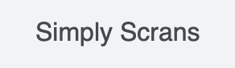
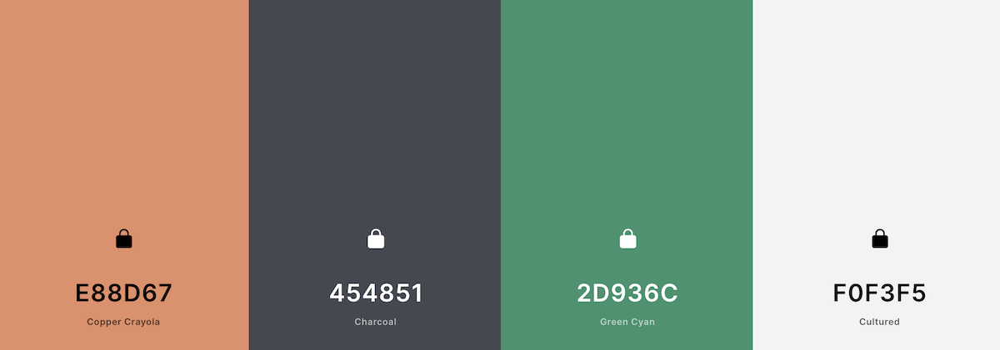
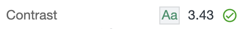
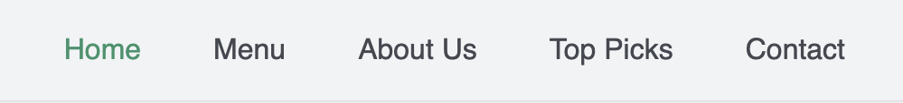
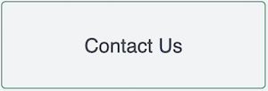

<h1 align="center">IFD Milestone Project - Simply Scran's </h1>

Simply Scrans is a front-end interactive platfrom that is designed for users to browse our favourite recipes to help you cook delicious meals that are inspired from all over the world. 

 This webpage is designed as part of my Code Institutes Full Stack Diploma, Please click the link below to view my webpage:
 [Click Here](https://wilko90.github.io/Simply-Scran/)

 **This website is for eductional purposes only**

 # Table of Contents
 1. [UX](#ux)
    * [Strategy](#sratergy-plane)
    * [Scope](#scope)
    * [Structure](#structure)
    * [Skeleton](#skeleton-plane)
    * [Surface](#surface-plane)
2. [Features](#features)
3. [Technologies](#technologies-used)
4. [Testing](#testing)
5. [Deployment](#deployment)
6. [Credits](#credits)
7. [Acknowledgements](#acknowledgements)

<h1 align="center">UX</h1> 

# Strategy 

## Research
###What are the most important aspects to a recipe website?

"I would like to navigate with a user-friendy interface and find your favourite recipes"
"I would like to find a food recipe that doesnt have to make me scroll through unnecessary content to find it"
"I would like a simple step by step guide of how to cook my desired dish"

### Competitor Review
[Delicios Magazine](https://www.deliciousmagazine.co.uk/) - To much content on one page, messy interface, difficult to navigate  
[Epicurious](https://www.epicurious.com/) - Background story of recipes resulting in unnecessary scrolling and potentially lead the user astray  
[Simply Recipes](https://www.simplyrecipes.com/) - Littered with advertisments resulting in bad UX  

## Business Approach

### Mission Statment

A person can be satisfied by eating a good meal as well as reading about one. Simply Scran's is their to educate readers of all levels who are intrested in a diverse world of cooking. We want our users to be engage in the simplist of ways and always feel in control. 
 

### Branding

* Branding defines you as your business 
* Identify key values 
* Consistency 
* Clear focus that knows there target audience
   

### Content
* Keep it simple
  * Simple navagable design to prevent user distraction.
* Findable content
   * Findable content is designed in a way that allows users to find content through navigation and search.
* Clear from the outset
   * Clear content is designed with clear purpose and does not leave users with questions.
* Human Conection
   *  Connect with user for engagment.
* Helpful content
   * Helpful content is designed in a way that allows users to get something done.
 
### Aesthetics

* Colour
   * Deliberate use of colours to influence the user experience on a website.
* Images
   * Imagery that will be appealing to your audience and is also relevant and truly adds value to your message.
* Navigation
   * Make it easy for visitors to find what they are looking for. Multiple tools for accessing information.
* Textual Content
   * keyword-rich content. Use headings and subheadings. 
* Consistency
   * Consistent throughout so that a visitor navigating from page to page will always know where they are and how to get to the next item of interest. 
* Alignment
   * Elements to be visually connected and balanced.

### Pricing
  
  * This is a free to use webpage.  

 ## User stories

This website is designed for users to be able to ensure that the best possible food items are produced every time with a simple interactive interface.

* `As a visiting user I want to be able to understand the websites purpose so i can decide if i want to continue navigating`
 
* `As an invovled user I want the surface to be simple with an aesthetically pleasing design`

* `As a connected user I want to be able to browse your favourite recipes and receive clear insturctions on how to cook them`

* `As a connected user I want to be able to communicate with the site admin in a easy User-friendly way`

* `As a connected user I want to be able to find the best places to eat & drink in london`

* `As a mobile user I want to be able to have the same features as the dektop site so I can connect with recipes on the go`

## opportunities and problems to be solved from user stories
 
|Opportunities | Importance | Viability / Feasibility
|-----|:------:|:-----:|
|**Purpose Of Webpage Explained** | 5 | 5 |
|**Intuitive Design** | 5 | 5 |
|**Clear Instructions** | 5 | 5 |
|**Easy Point Of Contact** | 5 | 3 |
|**Clear Results**| 5 | 5 |
|**Provide POI** | 3 | 4 |

# Scope 

## Website Requirements

#### User Needs
* Easy Navigation
* Attractive Design
* Relevant Content
* Product visuals and descriptions
* Intuitive design and user experience
  

#### Engagment
* Reading & Absorbing Content
* High speed site
* Clutter free
* Responsive Design
* Prominent call to action
 

#### Translates / Purpose
* Build An Online Presence
* Increase brand popularity
* Effective communication with users
* Content available on the website is easy to structure and systematize

# Structure 

The website uses a single page with the content being constructed with JavaScript, as the user navigates through the website. 

## Home Page

#### Home
 * Clear brand logo
 * Introduction to webpage
 * Understand the websites values from inital contact
 * Hero section Including mission statement
 * Clear navigation menus
#### About Us
* Informative.Tells a short story, provides idea of webpage.
* As users discover the brand, distinguish what sets the webpage apart and makes you
* Useful

#### Menu
* Hand picked content to showcase the websites recipes
* Eye-catching, makes user engage
* Simple cooking method & Instructions

#### Contact
* Boosting user engagment
* Get visitors Intrested 
* Functional 
* interacts with users input
* Personal
#### Top Picks
* Take data from an API
* Explain, store and organise structuredly
* Simple, user-friendly interface
* clear call to action 
* results data extracted from API when user engages
* Instructive layout 
* All information detailed and understandable
* Fully responsive 

#### Modals
* All have clear call to action points 
* Responsive
* Consistent structure & match design

#### Footer
* Attatched to bottom of page
* Footer split in to sections
   * Social Links 
   * Brand name
   * Disclaimer

 
# Skeleton Plane 

### Wireframes

During the development process chnages have been made. All wireframes are the core skeleton to aid in the planning process and are not the final look of the design. I recommend that the PNGs are downloaded to be viewed in your own browser.  

-  [Homepage](https://github.com/wilko90/Simply-Scran/blob/master/static/wireframes/homepage-desktop-tablet-mobile.png)

# Surface Plane 

## Brand Image
The brand Image/logo for "Simply Scrans" had to be simple, easy on the eye and co-ordinate with the overall theme. It is located at the head of the page and when engaged navigates the user back to the home section.

## Colour Schemes

The projects design is to remain consistant throughout, the aim was to implement a soft palette and eye catching for the user. 
This was designed with the main font [Nunito](https://fonts.google.com/specimen/Nunito) and styled with CSS

All colour choices where assesed within the guidelines of [Web Content Accessibility Guidelines](https://www.w3.org/TR/WCAG20/). Each colour was used with [Contrast Ratio](https://contrast-ratio.com/#%23212121-on-%23F0F3F4) and graded within the guidelines of [W3](https://www.w3.org/TR/WCAG20/) .

#### Green/Cyan (#2D936C)
This is the most important choice of colour which I have implemented throughout the design. 
Green symbolises fresh produce which matches with the projects main purpose.   

#### Charcoal (#454851)
Charcoal replaced the colour black as its more soft on the eye and gives a modern/professional feel.

#### Cultured (#F0F3F5)
An off white background helps soften the users visual experience and adds visual emphasis to other important parts of the design

#### Copper Crayola (#E88D67)
Unfortunately I had to remove this colour from any form of text, as it fails the W3 on a Cultured (#F03FD) background.
I managed to implement it on the social links hover rule to add a robust feel when the user engages.  
## Typography 

[Nunito](https://fonts.google.com/specimen/Nunito) font was used for a well balanced look and professional look, font weight of 200 used on small text and bold used on the titles for a stand out look. 

## Images

The Five images used where from free to use sources imagery from [Google](https://www.google.com/). All images will be credited in the credits section below.

## Visual Interactions
### navbar
The navbar is the main method of navigating throughout the site and is a key role in aiding in strong UX.
Each navigational link when idle remains Charcoal (#454851) unless initiated by user, when this happens the state of the navagtional link changes to Green/Cyan (#2D936C).
this helps aids in functionality and remain intuitive. 

### Call To Action Buttons
Point of contact needs to be appealing and interactive. for the main C2A points I went in too great detail of styling which provides the user with a visual appearance.
As C2A points a are important in providing a good UX, I kept the consistant feel of freshness. When ideal the C2A remain clear with a cyan border until the user initates there met by a swooping Green/Cyan effect
to help draw the user in. 

 

# Features 

## Existing Features

 
## Features To Implement

# Technologies Used 

### Languages Used

* [HTML](https://en.wikipedia.org/wiki/HTML) was used as the standard mockup language to build my project.
* [CSS](https://en.wikipedia.org/wiki/CSS) was used to style my website and implement my ideas from the surface plane.
* [Javascript](https://en.wikipedia.org/wiki/JavaScript). 

### Frameworks, Libraries and Programmes

* My Project was written and developed using [Gitpod](https://gitpod.io/workspaces/).
* My projects uses [Github](https://github.com/) as a web based platfrom to store and host repositories.
* The template I used was a guide made from [Code Institute](https://github.com/Code-Institute-Org/gitpod-full-template).
* My project uses [Boot Strap](https://getbootstrap.com/) 4.5.2 to aid with responsive and mobile first design.
* [popper.js](https://popper.js.org/) 1.14.3 Tool tip, positioning engine.
* The typography used in my project came from [google fonts](https://fonts.google.com/)
* My project uses [Font Awsome](https://fontawesome.com/) v5.0.10 for icons and tool set kits.
* The wireframes were made with a programme called [balsamiq](https://balsamiq.com/)
* My projects colour ratio was tested with [Contrast Ratio](https://contrast-ratio.com/)
* My projects logo and typography was graded with [W3](https://www.w3.org/TR/WCAG/#contrast-minimum) guidelines.
* To aid my css compatabilty for browser support I used [Auto Prefixer](https://autoprefixer.github.io/)
* [Techsini](https://techsini.com/multi-mockup/index.php) A tool I used to show that my design is responsive at the head of my Readme.
* css code beautified with [minifycocde](http://minifycode.com/css-beautifier/).
* html code formated using [Github](https://www.gitpod.io/docs/tips-and-tricks/#format-document) formating tool 

# Testing 

For full testing section [click here](TESTING.md) 

# Deployment 
### How my project was deployed

1. Log in to [Github](https://github.com/)
2. Click on the repository [UCFD-Milestone-Daftpunk-Discography](https://github.com/wilko90/UCFD-Milestone-Daftpunk-Discography) 
3. From the repositories in sub-headings, select "Settings".

4. Scroll down until you reach the heading `Github Pages`
5. From the dropdown list under the "Source" heading, select "master".
6. The second drop-down menu that appears should remain as "/root".
7. Press save
8. After the page refreshes, proceed to scroll back down to `Github Pages` when the link is avaliable it will be highlighted in green. 

### How to Clone a repository
1. Log in to [Github](https://github.com/)
2. Click on the repository [UCFD-Milestone-Daftpunk-Discography](https://github.com/wilko90/UCFD-Milestone-Daftpunk-Discography) 
3. Navigate to the list of files and click the button `Code`
4. To clone the repository using HTTPS copy the link below either manually or with the clipboard icon. (https://github.com/wilko90/UCFD-Milestone-Daftpunk-Discography.git) 
5. Open your preferred IDE software e.g [Atom](https://atom.io/) or [PhyCharm](https://www.jetbrains.com/pycharm/)
6. Create a directory where you would like your clone to be stored.
7. Type `git clone`, and then paste the URL you copied earlier(https://github.com/wilko90/UCFD-Milestone-Daftpunk-Discography.git)
8. Press `Enter` to create your clone   

For more Information have a look at the official git hub page on cloning a repository [Click here](https://docs.github.com/en/github/creating-cloning-and-archiving-repositories/cloning-a-repository)

### Manually downloading
1. Log in to Github
2. Click on the repository [UCFD-Milestone-Daftpunk-Discography](https://github.com/wilko90/
3. Navigate to the list of files and click the button `Code`
4. Select `Download Zip`
5. A downloaded zip file will be stored on your computer, Unzip this file, the contents should open as a folder.
6. Open your prefered IDE software
7. Search your system to locate unzipped file.
8. Run the file. 

# Credits 

* All other content is written by myself.

* Favicon came from [Iconfinder](https://www.iconfinder.com/)

## Code

# Acknowledgements 

-
 
 
