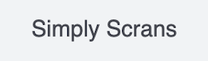
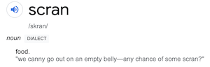
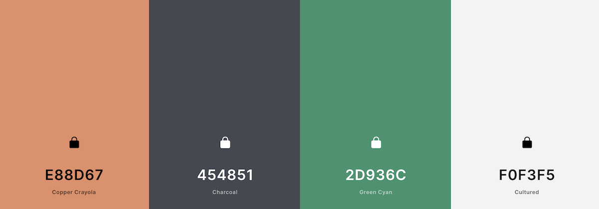
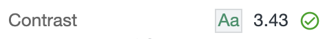
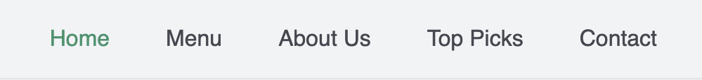
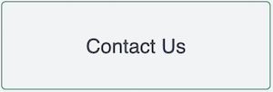
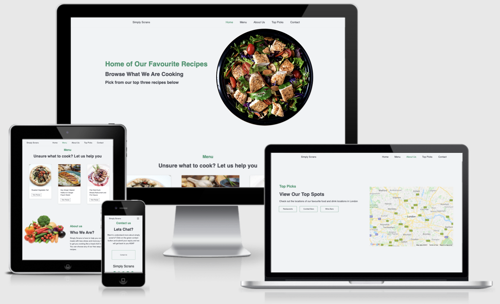

<h1 align="center">IFD Milestone Project - Simply Scrans </h1>

 

Simply Scrans is a front-end interactive platform that is designed for users to browse our favorite recipes to help you cook delicious meals that are inspired from all over the world. 

 This webpage is designed as part of my Code Institutes Full Stack Diploma, Please click the link below to view my webpage:
 [Click Here](https://wilko90.github.io/Simply-Scran/)

 **This website is for educational purposes only**

 # Table of Contents
 1. [UX](#ux)
    * [Strategy](#sratergy-plane)
    * [Scope](#scope)
    * [Structure](#structure)
    * [Skeleton](#skeleton-plane)
    * [Surface](#surface-plane)
2. [Features](#features)
3. [Technologies](#technologies-used)
4. [Testing](#testing)
5. [Deployment](#deployment)
6. [Credits](#credits)
7. [Acknowledgements](#acknowledgements)

<h1 align="center">UX</h1> 

# Strategy 

## Research
### What are the most important aspects of a recipe website?

"I would like to navigate with a user-friendly interface and find your favourite recipes"
"I would like to find a food recipe that doesn't have to make me scroll through unnecessary content to find it"
"I would like a simple step by step guide of how to cook my desired dish"

### Competitor Review
[Delicios Magazine](https://www.deliciousmagazine.co.uk/) - To much content on one page, messy interface, difficult to navigate  
[Epicurious](https://www.epicurious.com/) - Background story of recipes resulting in unnecessary scrolling and potentially lead the user astray  
[Simply Recipes](https://www.simplyrecipes.com/) - Littered with advertisments resulting in bad UX  

## Business Approach

### Mission Statment

A person can be satisfied by eating a good meal as well as reading about one. Simply Scran's is there to educate readers of all levels who are interested in a diverse world of cooking. We want our users to engage in the simplest of ways and always feel in control. 
 

### Branding

* Branding defines you as your business 
* Identify key values 
* Consistency 
* Clear focus that knows their target audience
   

### Content
* Keep it simple
  * Simple navigable design to prevent user distraction.
* Findable content
   * Findable content is designed in a way that allows users to find content through navigation and search.
* Clear from the outset
   * Clear content is designed with a clear purpose and does not leave users with questions.
* Human Connection
   *  Connect with a user for engagement.
* Helpful content
   * Helpful content is designed in a way that allows users to get something done.
 
### Aesthetics

* Colour
   * Deliberate use of colours to influence the user experience on a website.
* Images
   * Imagery that will be appealing to your audience and is also relevant and truly adds value to your message.
* Navigation
   * Make it easy for visitors to find what they are looking for. Multiple tools for accessing information.
* Textual Content
   * keyword-rich content. Use headings and subheadings. 
* Consistency
   * Consistent throughout so that a visitor navigating from page to page will always know where they are and how to get to the next item of interest. 
* Alignment
   * Elements to be visually connected and balanced.

### Pricing
  
  * This is free to use webpage.  

 ## User stories

This website is designed for users to be able to ensure that the best possible food items are produced every time with a simple interactive interface.

* `As a visiting user I want to be able to understand the purpose of the website so I can decide if I want to continue navigating`
 
* `As an involved user I want the surface to be simple with an aesthetically pleasing design`

* `As a connected user I want to be able to browse your favourite recipes and receive clear instructions on how to cook them`

* `As a connected user I want to be able to communicate with the site admin in an easy User-friendly way`

* `As a connected user I want to be able to find the best places to eat, drink in London and know information on that venue`

* `As a mobile user I want to be able to have the same features as the desktop site so I can connect with recipes on the go`

## opportunities and problems to be solved from user stories
 
|Opportunities | Importance | Viability / Feasibility
|-----|:------:|:-----:|
|**Purpose Of Webpage Explained** | 5 | 5 |
|**Intuitive Design** | 5 | 5 |
|**Clear Instructions** | 5 | 5 |
|**Easy Point Of Contact** | 5 | 3 |
|**Clear Results**| 5 | 5 |
|**Provide POI** | 3 | 4 |

# Scope 

## Website Requirements

#### User Needs
* Easy Navigation
* Attractive Design
* Relevant Content
* Product visuals and descriptions
* Intuitive design and user experience
  

#### Engagement
* Reading & Absorbing Content
* High-speed site
* Clutter free
* Responsive Design
* Prominent call to action
 

#### Translates / Purpose
* Build An Online Presence
* Increase brand popularity
* Effective communication with users
* Content available on the website is easy to structure and systematize

# Structure 

The website uses a single page with the content being constructed with JavaScript, as the user navigates through the website. 

## Home Page

#### Home
 * Clear brand logo
 * Introduction to webpage
 * Understand the values of the website from initial contact
 * Hero section Including a mission statement
 * Clear navigation menus
#### About Us
* Informative. Tells a short story, provides an idea of the webpage.
* As users discover the brand, distinguish what sets the webpage apart and makes you
* Useful

#### Menu
* Handpicked content to showcase the recipes of the website
* Eye-catching, makes user engage
* Simple cooking method & Instructions

#### Contact
* Boosting user engagement
* Get visitors Interested 
* Functional 
* interacts with users input
* Personal
#### Top Picks
* Take data from an API
* Explain, store and organise structured
* Simple, user-friendly interface
* clear call to action 
* results data extracted from API when the user engages
* Instructive layout 
* All information detailed and understandable
* Fully responsive 

#### Modals
* All have clear call to action points 
* Responsive
* Consistent structure & match design

#### Footer
* Attatched to bottom of page
* Footer split in to sections
   * Social Links 
   * Brand name
   * Disclaimer

 
# Skeleton Plane 

### Wireframes

During the development process, changes have been made. All wireframes are the core skeleton to aid in the planning process and are not the final look of the design. I recommend that the PNGs are downloaded to be viewed in your browser.  

-  [Homepage](https://github.com/wilko90/Simply-Scran/blob/master/static/wireframes/homepage-desktop-tablet-mobile.png)

# Surface Plane 

## Brand Image
The brand image/logo for "Simply Scrans" had to be simple, easy on the eye and coordinate with the overall theme. It is located at the head of the page and when engaged navigates the user back to the home section.

## Colour Schemes

The project's design is to remain consistent throughout, the aim was to implement a soft palette and eye catching for the user. 
This was designed with the main font [Nunito](https://fonts.google.com/specimen/Nunito) and styled with CSS

All colour choices were assessed within the guidelines of [Web Content Accessibility Guidelines](https://www.w3.org/TR/WCAG20/). Each colour was used with [Contrast Ratio](https://contrast-ratio.com/#%23212121-on-%23F0F3F4) and graded within the guidelines of [W3](https://www.w3.org/TR/WCAG20/) .

#### Green/Cyan (#2D936C)
This is the most important choice of colour which I have implemented throughout the design. 
Green symbolises fresh produce which matches the projects main purpose.   

#### Charcoal (#454851)
Charcoal replaced the colour black as its more soft on the eye and gives a modern/professional feel.

#### Cultured (#F0F3F5)
An off white background helps soften the user's visual experience and adds visual emphasis to other important parts of the design

#### Copper Crayola (#E88D67)
Unfortunately, I had to remove this colour from any form of text, as it fails the W3 on a Cultured (#F03FD) background.
I managed to implement it on the social links hover rule to add a robust feel when the user engages.  
## Typography 

[Nunito](https://fonts.google.com/specimen/Nunito) font was used for a well-balanced look and professional look, font-weight of 200 used on small text with bold used on the titles for a stand outlook. 

## Images

The Five images used were from free to use sources imagery from [Google](https://www.google.com/). All images will be credited in the credits section below.

## Visual Interactions
### navbar
The navbar is the main method of navigating throughout the site and is a key role in aiding in strong UX.
Each navigational link when idle remains Charcoal (#454851) unless initiated by the user, when this happens the state of the navigational link changes to Green/Cyan (#2D936C).
this helps aids in functionality and remain intuitive. 

### Call To Action Buttons
The point of contact needs to be appealing and interactive. for the main C2A points, I went into great detail about styling which provides the user with a visual appearance.
As C2A points are important in providing a good UX, I kept the consistent feel of freshness. When ideal the C2A remain clear with a cyan border until the user initiates there met by a swooping Green/Cyan effect
to help draw the user in. 

 

# Features 

## Existing Features

### Retrieving Goole API 
The main feature in my webpage is extracting data from [Google Maps API](https://developers.google.com/maps/documentation/javascript/overview) and incorporating it into clickable buttons to make the user interact with the map.
On each click of a button, markers will drop on the map, and then the markers themselves once clicked will open an info window. 
The info windows contain information on each location such as the name and address of the placed marker. The info windows contain details of opening hours, menus that are linked to an external source and contact number.

### Navigation Effects
Navigation plays a key role in user experience, implementing visually pleasing effects makes the website more dynamic and interactive.
Adding the feature [Scroll Reveal](https://scrollrevealjs.org/) which is a JavaScript library for easily animating elements as they enter/leave the viewport. Java script has also been used to change the colour state of the navbar links when interacted with, this is to allow the user to understand what section of the webpage they are in.

### Contact 
This is a place to connect the user and the admin. I designed this feature in a modal for not navigating the user away from the main page.
When the contact button is initiated you are presented with a modal containing a form with five inputs to be interacted with. The functionality of the form is connected with [Emailjs](https://www.emailjs.com/).
 
### Favicon Iconfinder

My favicon is an image of an avocado to symbolise freshness. The image is situated in the tab, this helps the webpage stand out if the user's address bar is cluttered.

### Modals

Modals are implemented into the site, using Bootstrap, to provide an additional degree of interactivity. Modals avoid the need to use window pop-ups or page reloads
and keep the user's usability on the site. The models contain the method and ingredients in a simplistic eye-catching design.

### Responsive Design

This project is designed to be fully compatible and interactive on all screen types and sizes, ensuring maximum functionality down to 280px width screen sizes.
All features implemented have been adjusted to a size where necessary in the `stylesheet.css` using `@media`. This allows you to not only vary viewport dimensions based on screen size but also allows me to set different style properties for different devices.

## Features To Implement

### Food Search Engine

Extract data from a recipe API engine to allow the user to be able to search, Save and organize recipes.

### Registration And Log In 

Implement signup and login page to allow users to access their saved recipes at any given time, this feature will need an open-source data base [mySQL](https://www.mysql.com/).

### Social Platform 

Allow users to interact with each other by comparing recipes, cooking techniques and stories. This can be implemented using HTML,CSS and javascript.

# Technologies Used 

### Languages Used

* [HTML](https://en.wikipedia.org/wiki/HTML) was used as the standard mockup language to build my project.
* [CSS](https://en.wikipedia.org/wiki/CSS) was used to style my website and implement my ideas from the surface plane.
* [Javascript](https://en.wikipedia.org/wiki/JavaScript).was used to implement interactive features.

### Frameworks, Libraries and Programmes

* My Project was written and developed using [Gitpod](https://gitpod.io/workspaces/).
* My project uses [Github](https://github.com/) as a web based platform to store and host repositories.
* The project was debugged using [Google Chrome Dev](https://developer.chrome.com/docs/devtools/) tools.
* The template I used as a guide made from [Code Institute](https://github.com/Code-Institute-Org/gitpod-full-template).
* My project uses [Jquery 3.3.1](https://jquery.com/) a javascript library to aid in HTML traversal, event handling, animation, and Ajax.
* My project uses [Scroll Reveal](https://scrollrevealjs.org/) JavaScript library to animate elements as they scroll into view.
* My project uses [Email.JS](https://www.emailjs.com/) to send an email directly from javaScript.
* My projects [Favicon-generator](https://www.favicon-generator.org/) to convert the Favicon to the appropriate format.
* My project uses [Sweet Alert](https://sweetalert2.github.io/) a replacement for JavaScript's popup boxes.
* My projects API's extracted data from [GoogleAPI](https://console.cloud.google.com/apis/dashboard?pli=1).
* My project uses [Boot Strap](https://getbootstrap.com/) 4.5.2 to aid with the responsive and mobile-first design.
* [Popper.js](https://popper.js.org/) 1.14.3 Tooltip, positioning engine.
* The typography used in my project came from [google fonts](https://fonts.google.com/).
* My projects accessibility was tested with [Google Lighthouse](https://developers.google.com/web/tools/lighthouse)
* My project uses [Font Awesome](https://fontawesome.com/) v5.15.3 for icons and toolset kits.
* The wireframes were made with a programme called [balsamiq](https://balsamiq.com/).
* My projects colour ratio was tested with [Contrast Ratio](https://contrast-ratio.com/).
* My projects logo and typography was graded with [W3](https://www.w3.org/TR/WCAG/#contrast-minimum) guidelines.
* To aid my CSS compatibility for browser support I used [Auto Prefixer](https://autoprefixer.github.io/).
* [Techsini](https://techsini.com/multi-mockup/index.php) A tool I used to show that my design is responsive.
* CSS code beautified with [minifycocde](http://minifycode.com/css-beautifier/).
* HTML code formatted using [Github](https://www.gitpod.io/docs/tips-and-tricks/#format-document) formating tool 

# Testing 

For full testing section [click here](TESTING.md) 

# Deployment 
### How my project was deployed

1. Log in to [Github](https://github.com/)
2. Click on the repository [UCFD-Milestone-Daftpunk-Discography](https://github.com/wilko90/UCFD-Milestone-Daftpunk-Discography) 
3. From the repositories in sub-headings, select "Settings".
4. Scroll down until you reach the heading `Github Pages`
5. From the dropdown list under the "Source" heading, select "master".
6. The second drop-down menu that appears should remain as "/root".
7. Press save
8. After the page refreshes, proceed to scroll back down to `Github Pages` when the link is available it will be highlighted in green. 

### How to Clone a repository
1. Log in to [Github](https://github.com/)
2. Click on the repository [Simply-Scrans](https://wilko90.github.io/Simply-Scran/) 
3. Navigate to the list of files and click the button `Code`
4. To clone the repository using HTTPS copy the link below either manually or with the clipboard icon. (https://wilko90.github.io/Simply-Scran/.git) 
5. Open your preferred IDE software e.g [Atom](https://atom.io/) or [PhyCharm](https://www.jetbrains.com/pycharm/)
6. Create a directory where you would like your clone to be stored.
7. Type `git clone`, and then paste the URL you copied earlier(https://wilko90.github.io/Simply-Scran/.git)
8. Press `Enter` to create your clone   

For more information have a look at the official git hub page on cloning a repository [Click here](https://docs.github.com/en/github/creating-cloning-and-archiving-repositories/cloning-a-repository)

### Manually downloading
1. Log in to Github
2. Click on the repository [Simply Scrans](https://github.com/wilko90/Simply-Scran)
3. Navigate to the list of files and click the button `Code`
4. Select `Download Zip`
5. A downloaded zip file will be stored on your computer, Unzip this file, the contents should open a folder.
6. Open your prefered IDE software
7. Search your system to locate the unzipped file.
8. Run the file. 

# Credits 

## Written Content

All content is written by myself.

## Modal Content 

All recipes are used from external sources:

* Roasted vegetable tart recipe was taken from [Food and Wine](https://www.foodandwine.com/recipes/roasted-vegetable-tarts).
* Soy-Ginger Glazed Halibut w/ Ginger Peach Relish was taken from [Southern Fatty](https://www.southernfatty.com/chargrilled-glazed-halibut/).
* Pan-fried Duck Breast, Redcurrant and Port Sauce was taken from [Spar](https://www.spar.co.uk/recipes/pan-fried-duck-breast-with-redcurrant-and-port-sauce).

## Images

The images used in this site were obtained from multiple sources I located through google searches that are free to download. Below are the links.

* Initial home image: [PNG find](https://www.pngfind.com/).
* Roasted vegitable tart image: [Food and Wine](https://www.foodandwine.com/recipes/roasted-vegetable-tarts).
* Soy Ginger Glazed Halibut w/ Ginger Peach Relish image: [Southern Fatty](https://www.southernfatty.com/chargrilled-glazed-halibut/).
* Pan-fried Duck Breast,Redcurrant and Port Sauce image: [Spar](https://www.spar.co.uk/recipes/pan-fried-duck-breast-with-redcurrant-and-port-sauce).
* About Image: [PNG find](https://www.pngfind.com/)

## Code

* CSS button styling and hover effect [Youtube](https://www.youtube.com/watch?v=gM3IGPFwwvA&t=4s*/)
* Box Shadows [CSS Tricks](https://css-tricks.com/almanac/properties/b/box-shadow/)
* Map generation [Google Map](https://developers.google.com/maps/documentation/javascript/styling?authuser=1)
* Map markers [Google Map Markers](https://developers.google.com/maps/documentation/javascript/markers?authuser=1)
* Map Info Windows [Google Map Info Windows](https://developers.google.com/maps/documentation/javascript/infowindows?authuser=1)
* Scroll Sections [Youtube](https://www.youtube.com/watch?v=RsPWEmfOQdU)
* Scroll Reveal [Stack Overflow](https://stackoverflow.com/questions/40620736/scrollreveal-javascript-not-defined)
* Contact form powered with [Email.js](https://www.emailjs.com/)
* Contact java script [Code Institue](https://codeinstitute.net/)
* Contact status 200 and 404 alert [Sweet Alert](https://sweetalert2.github.io/) 

# Acknowledgements 

* The Inspiration for this project came from my love of food and drink. I aim to make functionality simple, eye catching design and consistent throughout.

* Thank you to the slack community for guiding me in the right direction.

* Thank you to my girlfriend for supporting me throughout this project. 

* Thank you to my mentor Rohit for giving me good feedback and pointers
 
# Disclaimer

