<h1 align="center">IFD Milestone Project - Simply Scrans</h1>

For full readme [click here](README.md)

# Table of Contents

1. [User Story Testing](#user-story)
2. [Features Testing ](#features-testing)
3. [Further Testing](#further-testing)
4. [Browser Testing](#browser-testing)
5. [Validation Testing](#validation-testing)
6. [Bugs](#bugs)

# User Story Testing 
# "As a visiting user I want to be able to understand the purpose of the website so I can decide if I want to continue navigating"
Benchmark - A user must be able to understand the main purpose of the website's goals.

* On initial contact the user is welcomed by the logo that remains in its container and is visible to the user at all times.
* On initial contact the user is greeted with a short introduction and hero image which explains the website's purpose.
* on initial contact the user is greeted with a list of engageable features which will navigate the user throughout the page.

Outcome: Successful 

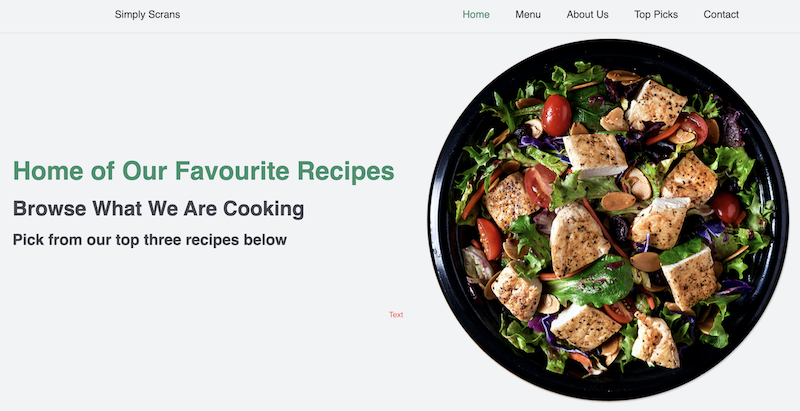

# "As an involved user I want the surface to be simple with an aesthetically pleasing design"
Benchmark - The website should be intuitive and be consistent with colour throughout

* On initial contact the user is greeted with a heading that summarizes the website's purpose.
* Consistency in colours throughout chosen by initial colour palette.
* All interactive features match with aesthetics and are descriptive of purpose.
* Surface is simple and easy to navigate.

Outcome: Successful 

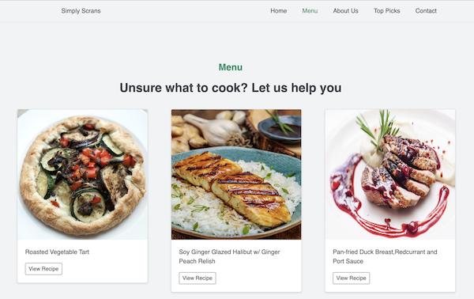 
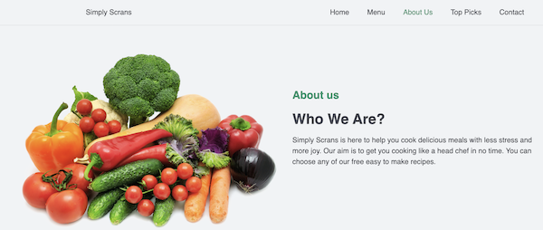
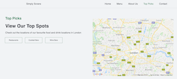 
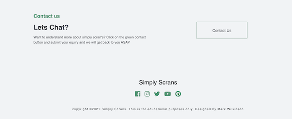 

# "As a connected user I want to be able to browse your favourite recipes and receive clear instructions on how to cook them"
Benchmark - To easily navigate to a recipe and be presented with introductions and the method on how to cook.

* The user can navigate by simply scrolling through the sections to find their desired recipe. 
* The user can interact via the navigation and bar and be sent to their desired recipe.
* When the user has chosen their desired recipe they can initiate the recipe by interacting with the view recipe button.
* The user is presented with descriptive yet intuitive instructions on how to cook and what ingredients they need.

Outcome: Successful 

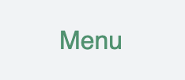 
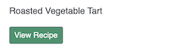 
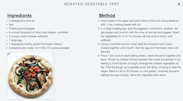  

# "As a connected user I want to be able to communicate with the site admin in an easy User-friendly way"

Benchmark - To comfortably locate the contact form and input the relative data to be able to contact the site admin.

* The user can navigate by simply scrolling through the sections to find the contact section
* The user can interact via the navigation and bar and be sent to the contact section.
* The user is greeted with a short yet descriptive heading to inform the user that they are in the correct section to contact the admin.
* The contact form is engaged by a large interactive C2A adjacent to the contact heading
* The user is presented with a popup form (modal) with five input fields and a large submit button.

Outcome: Successful

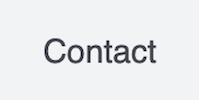
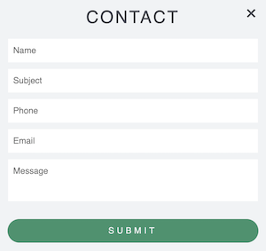
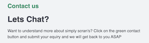

# "As a connected user I want to be able to find the best places to eat, drink in London and know information on that venue"

Benchmark - A user should be able to locate the top picks section, select one of three options, where a map will initiate markers that will have the relevant information on the venue.

* The user can navigate to the top picks section
* The user is presented with an informative header to lead the user into an engagement.
* Three clickable buttons that allow the user to engage with the map
* When the user engages with desired buttons, the user will be prompted on the map via a marker giving them the location of five venues.
* Each marker placed on the map can be interacted with showing the user a descriptive info window about the selected venue.

Outcome: Successful

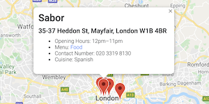
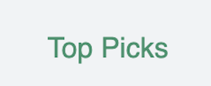
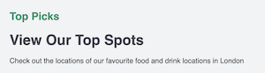
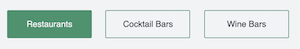

# As a mobile user I want to be able to have the same features as the desktop site so I can connect with recipes on the go

Benchmark - A user should be able to use all the features in any chosen viewport

* This website uses bootstraps functionality to be able to allow native compatibility in any viewport
* The top picks section allows the user to select their favourite venues on a mobile device by targeting classes with media queries.
* The map zoom has been increased for medium to small devices.
* Modals have been targeted with media queries to allow recipe content to be responsive to all viewports.

Outcome: Successful

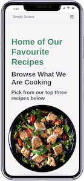
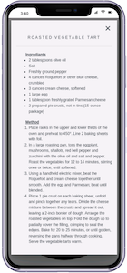
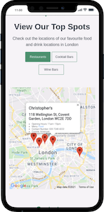

# Features Testing 

### Fetching API 

* Once page has fully loaded open google Dev tools.
   * Navigate to the console.
   * In the search bar search google.
   * Select maps in the curly braces.
   * large list of entries will show that lead to subdirectories.
* Further testing in dev tools.
   * Navigate to the Network Tab.
   * Refresh page, where the Dom and the load time will take place.
   * Under the name tab select the request name tag for google maps.
   * in the headers tab you will be present with a status code of 200.

### Navigation Bar
* On initial load ensure the navigation bar loads the full width of the screen with correct links and logo.
* Ensure each navigation link is active when pressed.
* Ensure each link when pressed sends the user to the correct section of the webpage.
* Ensure when the logo is initiated that the user is directed back to the home section.
* `Home`-`Menu`-`About Us`-`Top Picks`-`Contact`
* `Menu`-`About Us`-`Top Picks`-`Contact`-`Home`
* `About Us`-`Top Picks`-Contact-`Home`-`Menu`
* `Top Picks`-`Contact`-`Home`-`Menu`- `About Us`
* `Contact`-`Home`-`Menu`- `About Us`- `Top Picks`
* Ensure when manually scrolling that the navigation bar remains at the head of the page at all times.

### Modals

* Ensure the Modal opens when initiated via the buttons. 
* Ensure the Modal is displayed centrally, and the background is appropriately dimmed.
* Ensure the Modal has a header, body text, and a close button.
* Ensure the Modal can be closed via the button and also by engaging in the dimmed area.
* Ensure all content in the Modal fits appropriately within the Modal, and is legible.
* Ensure modal is responsive in all viewports.
* Ensure images contained in the modal are hidden when viewed in medium and small viewports. 
* Ensure the close button closes the Modal.
* Ensure buttons nested in modals are active.
* Ensure pressing the escape key closes the Modal.

### Google Maps

* Ensure map is visible and is aligned to the right on desktop or centred in mobile devices.
* Ensure map is at the correct latitude `51.503000` and longitude `-0.131550` (Central London) on initial load and when refreshed.
* Ensure map is at the correct zoom of `10` on desktop and `12` on viewports of 768 pixels or lower.
* Ensure the map can be manually zoomed in and out by pressing `ctrl` or `command` and scrolling with the mouse.
* Ensure the map can be manually zoomed in and out by using two fingers for touch-responsive devices.
* Ensure when buttons adjacent to the map are initiated that markers are present on the map at the correct location.
* Ensure when multiple buttons are pressed that the previous markers clear for the new ones.
* Ensure each marker can be selected and the relevant information window is present and is responsive to all viewports. 
* Ensure the information window has the relevant text and is responsive to all viewports.
* Ensure the information Windows can be closed by pressing the `X` button at the right of the window.
* Ensure when the page refreshes that the map is clear of all markers.

### Contact Form & Email.Js

* Ensure contact form appears when contact button is initiated.
* Ensure five fields are engageable with the relevant text
* Ensure only numbers can be inputted in the `phone` fields
* Ensure you need a `@` in the email field
* Ensure all fields need to have data in them before the form can be submitted
* Ensure Email.js is active and not showing errors
* Ensure when the form is submitted the modal closes automatically 
* Ensure a pop up is shown to confirm the form has been sent and auto closes after two seconds.
* Ensure the email is Successfully received and in the correct format (below) 
`Name` 
`Subject` 
`Phone` 
`Email` 
`Message` 

### Scroll Reveal

* Ensure Scroll reveal is in a const function and error-free.
* Ensure all selected sections are targeted and converted into strings.
* Ensure each section reveals in the correct order.
* Ensure when refreshed scroll reveal is active.

# Further Testing 
## Responsive Design

All testing above was again tested on multiple devices through chrome developer tools with their `toggle device tool bar`

Devices used for testing:
* Moto G4
* Galaxy S5
* Pixel 2
* Pixel 2XL
* iPhone 5/SE
* iPhone 6/7/8 (and plus)
* iPhone X
* iPad
* iPad Pro
* Surface Duo
* Galaxy Fold

All features are tested from viewports of 280px and above.

# Browser Testing 

 All browser testing was done with the same method above

 Problems usually occurred when my CSS was not compatible with most browsers. Running my CSS code through an Auto-Prefixer solved these compatibility issues.

## Chrome/Mircrosoft Edge

* All testing successful

## Mozilla Firefox

* All testing successful

## Safari

* All testing successful

## Internet Explorer

* My project uses ES6 which has compatibility issues with Internet Explorer. No further testing was made.

# Validation Testing 

 Validation testing was done with third party applications below:

## [W3 Vailidator](https://validator.w3.org/)

* HTML successfully passes W3 Validator

## [Jigsaw Validator ](https://jigsaw.w3.org/css-validator/)
* CSS successfully passes the W3 Jigsaw Validator
## [JSHint](https://jshint.com/)

* JS Hint was used to flag any errors or mistakes in the javascript code and was used consistently throughout the development process.
* No errors are present 
* Warnings present are due to template literals syntax that is only valid with ES6, however by adding `/*jshint esversion: 6 */` at the top of the script this removes the errors and takes into consideration of ES6 compatibility.

## [Google Lighthouse](https://developers.google.com/web/tools/lighthouse)

This feature is an open-source, automated tool for measuring the quality of a webpage.

Home (desktop)

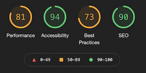

* Main issues due to a low-performance score is due to the sizing of the images, as I want the images to be as clear as possible and `.png` I  did not convert the file or size of these images.

Home (Mobile)

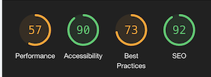

* Again main issues due to load time on images. [Google](https://web.dev/optimize-cls/?utm_source=lighthouse&utm_medium=devtools#images-without-dimensions) also recommends adding a height and width to each image. I noticed I ran into problems with responsiveness so reverted back to `width: 100%` `height: auto`.

# Bugs 

## Map Markers
### Issue with the map markers not appearing after the button was initiated.
 After researching the issue this error was due to not having the `callback` parameter of the Google Maps Javascript API key and also adding `async defer` processes the code parallel to the rest of the page content.

 Solution: Resolved

## Contact button not highlighting green when active on the navbar 
After trying to debug the issue in google dev tools and `console.log` the current section on the appropriate line of the code. Checking in google dev tools, the scroll for the contact section is not getting targeted.

Solution: Unresolved

## `X` button not working on modals

All models templates have been used via bootstrap and edited to my own specifications, All appropriate plugins were installed in the HTML script tags to allow JS to be imported via the bootstrap CDN to close the modal. However with the button not closing I resolved the issue by adding a jquery on-click event `$("#close-modal-button").modal("hide");` 

Solution: Resolved

For full readme [click here](README.md)

